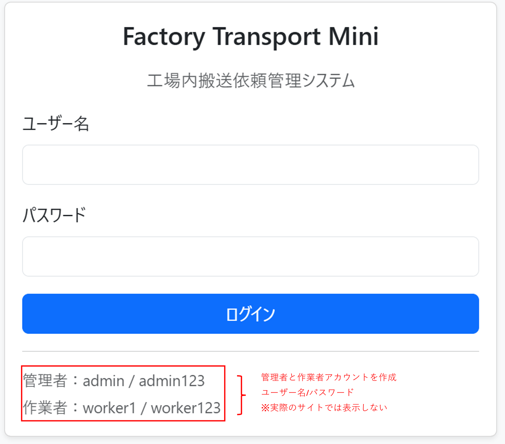
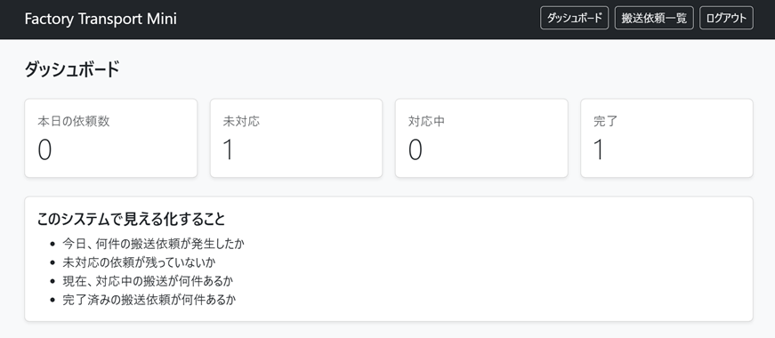
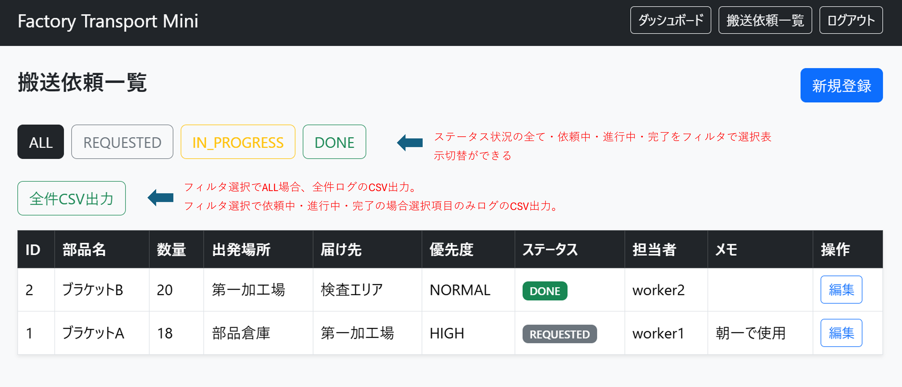
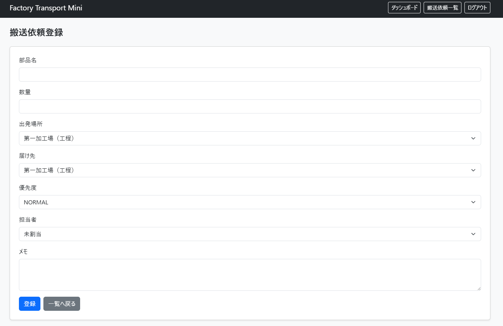
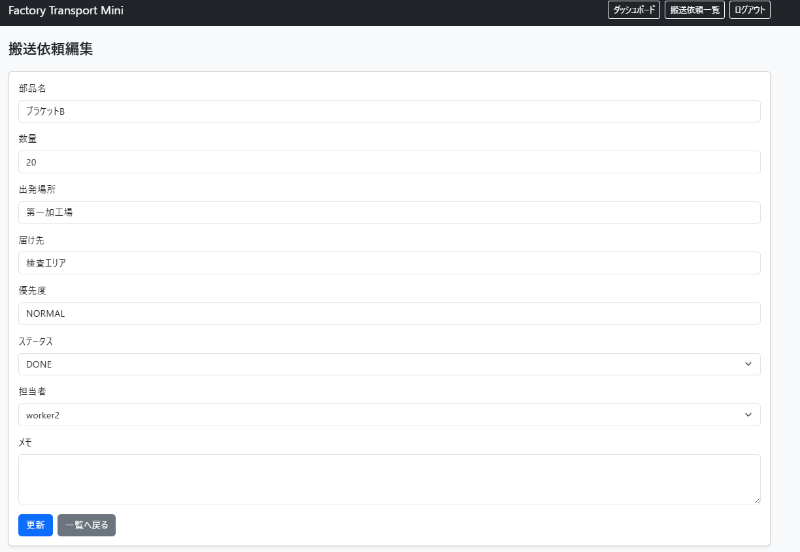
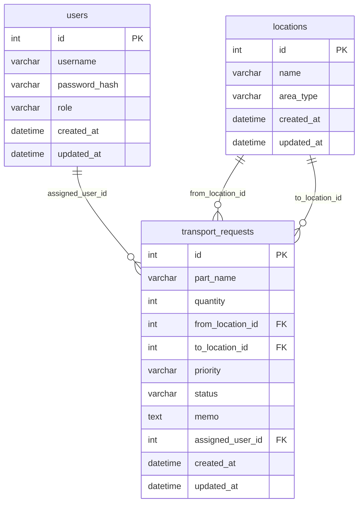

# Factory Transport Mini

Factory Transport Mini は、工場内で発生する搬送依頼を管理する製造業向け簡易Webシステムです。

---

## システム概要
Factory Transport Mini は、  
工場内で発生する部品搬送依頼を管理するシステムです。

現場では、

- どこからどこへ運ぶか
- 誰が担当するか
- 進捗はどうなっているか

がホワイトボードや口頭管理になりやすく、  
進捗見えない問題が発生します。

本システムでは、

- 搬送依頼登録
- 進捗可視化
- 担当者管理
- ステータス管理
- CSV出力

を行うことで、  
現場作業の見える化を実現します。

管理者は搬送依頼を登録し、担当者を変更できます。
作業者は全依頼を確認し、ステータスを更新できます。

搬送依頼には、部品名、数量、出発場所、届け先、優先度、メモ、担当者を登録します。

---

# 解決する現場課題

- 紙・口頭による搬送依頼管理
- 担当者不明
- 作業進捗不透明
- 完了状況追跡困難
- 日報・実績集計負荷

---

## 技術構成

| 分野 | 技術 |
|---|---|
| バックエンド | FastAPI |
| DB | MySQL |
| ORM | SQLAlchemy |
| マイグレーション | Alembic |
| 認証 | JWT × HttpOnly Cookie |
| 画面 | Jinja2 / Bootstrap |
| 環境構築 | Docker Compose |
| Language | Python 3.12 |

---

## 主な機能

1. ログイン
2. 搬送依頼登録
3. 搬送依頼一覧
4. ステータス更新
5. 簡易ダッシュボード

---

## 画面

| 画面 | 内容 |
|---|---|
| ログイン画面 | JWT認証によるログイン |
| ダッシュボード画面 | 本日の依頼数、未対応、対応中、完了件数を表示 |
| 搬送依頼一覧画面 | 全搬送依頼の一覧表示、ステータス更新、担当者変更 |
| 搬送依頼登録画面 | 管理者が搬送依頼を登録 |
### ログイン画面

### ダッシュボード画面 
- ログインするとダッシュボード画面へ移行

### 搬送依頼一覧画面
- ダッシュボード画面の右上の搬送依頼一覧画面を選択する

### 搬送依頼登録画面
- 搬送依頼一覧画面の新規登録ボタンを選択する

### 搬送依頼編集画面
- ダッシュボード画面の各行の操作の編集ボタンを選択

---

## DB設計

本システムでは以下の3テーブルを使用しています。

- users
- locations
- transport_requests

### ER図

docker compose up -d --build

docker compose restart app

docker compose down

### ログイン画面
http://localhost:8000/login

### コンテナ内のMySQLでテーブル確認
docker compose exec db mysql -uappuser -papppass factory_transport_db

SELECT DATABASE();
SHOW TABLES;

docker compose restart app

### seed.py の実行方法
docker compose exec app python -m app.seed
